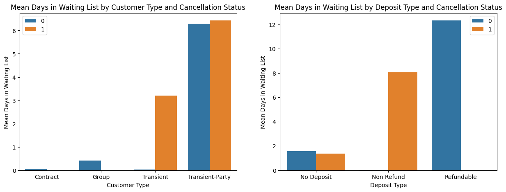
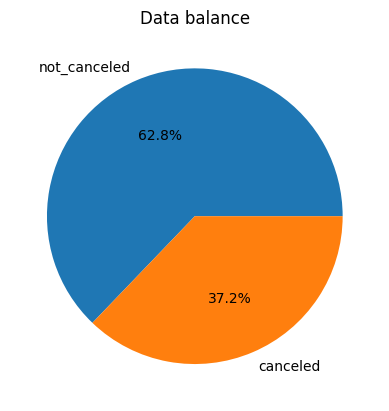
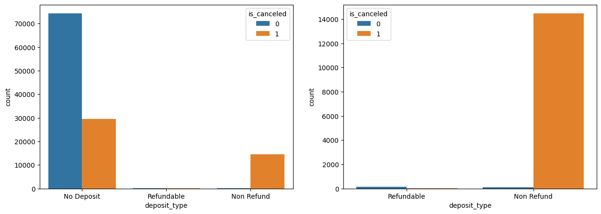
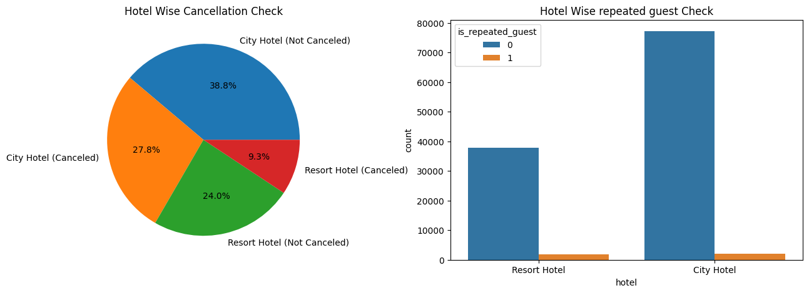

# [Hotel Booking Cancellation Prediction](Project_code.ipynb)

### About project
This is a end to end Machine Learning project where I perform Data Analysis,Data Prediction,Model Deployment

### About Dataset
 
dataset link:-https://www.kaggle.com/datasets/mojtaba142/hotel-booking

### Objective of project

Using above dataset I have to find different factors that affect booking to be cancelled and build a model that predict the future booking cancellation status.

### Approach

1.First performed dataset cleaning 
  
    =>Removing unwanted feature's like name,phone-number,creditcard etc.

    =>Finding and imputing missing values

2.Performing Data Analysis
 
    =>Check features relationship

    =>Check data balance 

    =>Make analysis report

3.After analysing data perform data preprocessing

    =>removing outliers

    =>Handle imbalance dataset(RandomOverSampler)

4.Use RandomForestClassifier to build model

5.perform hyperparameter tuning

6.Evaluate a model 

## Techniques used

 - [RandomForestClassifier](https://scikit-learn.org/stable/modules/generated/sklearn.ensemble.RandomForestClassifier.html)
 - [RandomOverSampler](https://imbalanced-learn.org/stable/references/generated/imblearn.over_sampling.RandomOverSampler.html)
 - [Evaluation metrics](https://scikit-learn.org/stable/modules/model_evaluation.html)

## Observation
1.Non-Refund deposit type has high cancelation rate

2.In summer season booking cancellation is high 

3.In summer booking is high due to increase of AverageDailyRate

4.Large Booking cancellation occur by making differ in customer reserved and assigned room type

5.Most of cancellation occur for room A type reservation 

6.Customer of transient-party type play mojor role in booking cancellation

7.bookings where Member more than five are all cancelled there bookings.

8.Non-repeated guest cancel more then repetitive guest

9.City hotel price is comparetively lower then Resort hotel price

10.Only two to three country have high number of members booked

### Some solutions to reduce booking cancellation

1.Try to advertise more on different countries to increase booking rate

2.Try to reduce price during summer season

3.Provide some seasonal offer to reduce booking cancellation.

4.Take care more for transient-party type customer

5.Try to provide customer demanded request 

###Some visualisation

